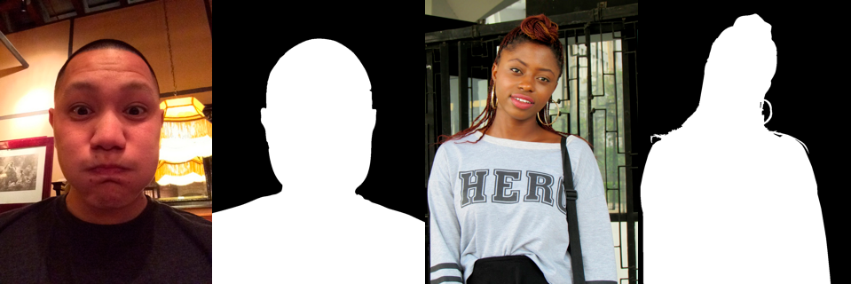

PicsArt AI Hackathon Online
===========================

Материалы к онлайн этапу [PicsArt AI Hackathon](https://picsart.ai/).

## Постановка задачи

Участникам соревнования предлагается решить задачу отделения человека на фотографии от фона. По изображению необходимо построить бинарную маску, в которой указать пиксели относящиеся к человеку. Пример масок сегментации:

## Набор данных

Ссылка на набор изображений: [picsart_hack_online_data.zip](https://bucketeer-db1966c9-c9f8-427d-ae61-659a91a9fca7.s3.amazonaws.com/public/picsart_hack_online_data.zip)

Для обучения моделей предоставляется выборка из ≈1500 размеченных картинок (каталог `train`) и масок сегментации (каталог `train_mask`). Маски представляю собой одноканальные изображения той же размерности, что и исходные изображения, и имеют только два значения цвета. Для оценки решений предоставляется тестовая выборка без соотвествующих масок (каталог `test`).

## Формат решения

В качестве решения необходимо построить разметку всех изображений из каталога `test`. 

Маски необходимо закодировать в формате [run-length encoding](https://en.wikipedia.org/wiki/Run-length_encoding) (RLE) и записать в CSV-файл. Формат RLE заключается в том что в строчку последовательно записываются пары чисел: номер стартового пикселя и число последовательно идущих пикселей, относящихся к маске. Например: '1 3 10 5' означает что маска состоит из пикселей с индексами 1,2,3,10,11,12,13,14. Пары должны быть отсортированы по возрастанию стартового пикселя, не должны пересекаться. Нумерация пикселей происходит c 1, сверху вних, затем слева направо: 1 означает пиксель (1,1), 2 — (2,1) и т.д.

Код для кодирования и декодирования формата RLE можно найти в [utils.py](./utils.py).

В проверяющую систему необходимо отправить файл с предсказаниями в формате `csv`, содержащий следующие колонки:
- `image` — номер изображения, указанный в имени файла (например, 11150)
- `rle_mask` — построенная маска, закодированная при помощи run-length encoding

Пример файла решения: [sample_submission.csv](https://bucketeer-db1966c9-c9f8-427d-ae61-659a91a9fca7.s3.amazonaws.com/public/picsart_hack_online_sample_submission.csv)

## Система оценки

Качество сегментации для каждого изображения оценивается с помощью [Dice Score](https://en.wikipedia.org/wiki/Sørensen–Dice_coefficient):

где X — предсказанная маска, Y — правильная маска из разметки, |X| — число пикселей, попавших в маску X.

Dice Score усредняется по всем тестовым изоражениям, имеющим разметку.

Функции для вычисления качества можно найти в [utils.py](./utils.py).

## Пример решения

Пример решения приведен в [Jupyter Notebook](https://jupyter.org)-е [PicsartHack_Baseline.ipynb](PicsartHack_Baseline.ipynb)

